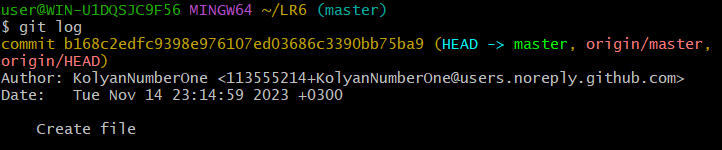

# Отчёт о лабораторной работе №6 по курсу "Основы программирования"
## Цель лабораторной работы
Изучение базовых возможностей системы управления версиями, опыт работы с Git Api, опыт работы с локальным и удаленным репозиторием. 

## Ход работы
Регистрация на GitHub

Форк репозитория

Установка Git-Bash. Настройка и клонирование репозитория

Добавлен файл file через сайт GitHub

Подтянуты изменения в локальный репозиторий

Получена история операций для ветки *master*

И для ветки *branch1*

Посмотрены последние изменения для ветки *master* 

И для ветки *branch1*

Выполнено слияние ветки *branch1* в ветку *master* 

Получен конфликт слияния. Разрешение конфликта.

Удаление побочной ветки

Подтверждение удаления

Сделал несколько изменений в файле с коммитами

Откат последнего коммита

Создание ветки для отчета

История операций

История операций в упрощенном варианте

## Вывод
Таким образом, я изучил базовые возможности системы управления версиями, получил: опыт работы с Git Api, опыт работы с локальным и удаленным репозиторием.